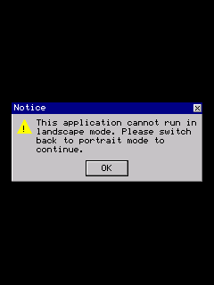

# Big Range Hunting 3D — Windows Mobile proof

## Root cause

The CAB is a native ARM Windows Mobile / Windows CE application. The baseline did not fail in the framebuffer loop: it crashed during C++ runtime initialization before the first draw. The game's `??_L` constructor callback created a Windows Media Player COM object with `CoCreateInstance`, but PocketHLE returned `E_NOTIMPL` and left the output interface pointer null. The next virtual call dereferenced address `0x00000000`, so `frame_counter` stayed at `0`.

## Fix

- Added a resident `ole32.dll` dynamic-export module.
- Implemented the Windows Media Player COM activation path used by this game, including a valid vtable and safe child-interface stubs.
- Kept the existing GAPI/GDI framebuffer and message-pump presentation path intact; successful initialization now reaches repeated rendered frames.
- Added the OLE32 module to `LoadLibraryW` and `GetProcAddress` resolution.

The COM class and interface identifiers match the Windows Media Player Mobile SDK interface used by the binary. Microsoft documents `CoCreateInstance` as the supported way to create the Windows Media Player object and documents the player interface methods separately. The repository's existing Windows Mobile fixes use the same pattern: replace the failing platform contract, then prove non-zero framebuffer progress with the tap helper.

## Verification

Build:

```text
cargo check -p pocket-cli --no-default-features --features unicorn
cargo build --release -p pocket-cli --no-default-features --features unicorn
```

Focused tests:

```text
cargo test -p pocket-winceapi --no-default-features
cargo test -p pocket-kernel --no-default-features
cargo test -p pocket-cli --no-default-features --features unicorn
```

All tests passed: pocket-winceapi 97/97, pocket-kernel 89/89, pocket-cli 9/9.

Baseline run: `baseline.log` records `READ unmapped at guest address 0x00000000`, with `frame_counter=0`, immediately after the null COM object path.

Fixed run through `tools/ai-tap-sequence.py`:

```text
python3 tools/ai-tap-sequence.py \
  /home/.z/chat-uploads/BigRangeHunting3-f0babecab5be.cab \
  --pockethle target/release/pockethle \
  --cpu unicorn \
  --max-slices 20000000 \
  --instructions-per-slice 1000000 \
  --message-budget 0 \
  --tap 120,190 \
  --dump-frames-to proof/big-range-hunting3-windows-mobile/frames \
  --max-frames 5
```

Result: **PASS** — exit status 0, clean emulator exit, 5 framebuffer captures, final `frame_counter=125`, and no CPU fault. `ai-tap-sequence.log` contains the complete helper output. `gameplay.png` is the final 240×320 screenshot and `gameplay.ppm` is the lossless capture.

A separate trace run at `--screen 320x240` also exited cleanly with `frame_counter=7`; `landscape-run.log` and `api-trace.jsonl` preserve that run and demonstrate that the emulated display reports the requested dimensions.

## Evidence



The baseline capture is black because no frame was rendered; the fixed capture shows the Windows Mobile orientation warning dialog and its complete interface, which is the game's first reachable screen after the initialization fix. The warning is an application-level portrait/landscape guard, not an emulator crash.
