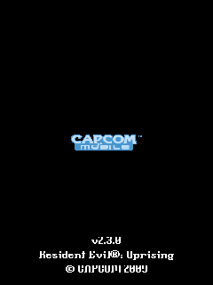
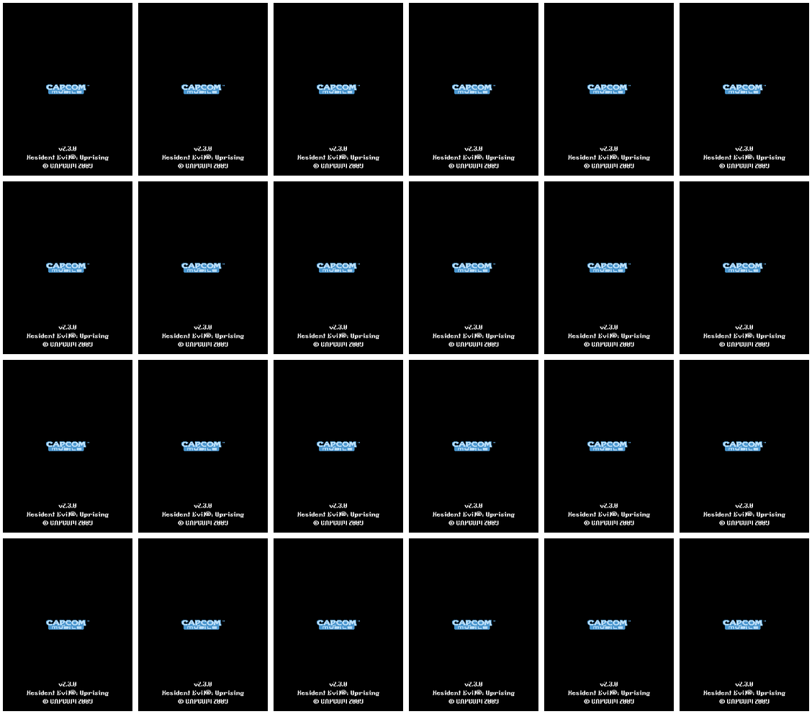

# Resident Evil Uprising — Windows Mobile proof

## Root cause

The Resident Evil Uprising ARM Windows Mobile build creates worker threads during `Application::startApp`. PocketHLE mapped each worker stack using only the requested `CreateThread` size. This title's worker enters a deeper CRT/runtime prologue before its first wait, so the stack underflowed into unmapped memory (`WRITE_UNMAPPED` near `0x61ffe400`) and stopped the cooperative emulator before the game could continue presenting frames.

The fix applies the Windows CE process-default stack size when a worker requests a smaller stack, and maps a small writable guard area around the usable stack. This preserves the existing worker scheduling model and GDI framebuffer presentation while allowing the worker to reach its normal wait points.

Resident Evil Uprising uses a GDI back buffer (`CreateDIBSection`, 480×800 RGB565) and presents it with `StretchBlt` to the 240×320 device screen. The fix also preserves the source dimensions in the `StretchBlt` path and scales the DIB into the screen surface instead of treating the operation as an unscaled blit. The resulting frame contains the CAPCOM Mobile title screen and copyright/version text.

## Verification

The supplied CAB was extracted and run with ARM Unicorn. No native Windows Mobile device or legacy Windows Mobile SDK emulator is available in this environment; the screenshots prove the Windows Mobile ARM execution and host framebuffer path used by PocketHLE.

```text
cargo build --release -p pocket-cli --no-default-features --features unicorn
cargo test -p pocket-kernel -p pocket-winceapi -p pocket-core --no-default-features --features pocket-core/unicorn
cargo fmt --all
```

The required tap helper was run against the supplied CAB after the fix:

```text
python3 tools/ai-tap-sequence.py \
  Resident_Evil_R__Uprising_HTC_Leo_EN_IGP_EU_WM_TS_230__T8585_-5a7aeb1ae9ba.cab \
  --pockethle target/release/pockethle \
  --cpu unicorn \
  --max-slices 8000000 \
  --instructions-per-slice 1000000 \
  --message-budget 0 \
  --tap 120,160 --tap 120,240 \
  --dump-frames-to proof/resident-evil-uprising/frames \
  --max-frames 24
```

Result: **PASS** — the emulator exited cleanly with status 0, the fixed run reached `frame_counter=48`, and the helper wrote 24 framebuffer captures. The captures are intentionally repetitive title-screen frames while the game waits for its next startup transition; every capture is non-black and contains the rendered CAPCOM Mobile screen. The pre-fix run reached `frame_counter=2` but terminated with `WRITE_UNMAPPED`, and only one black frame was captured.

The complete helper output is in `ai-tap-sequence.log`; the focused rendering trace is in `render-trace.log`. The raw PPM captures are in `frames/`, with a contact sheet in `contact-sheet.png`.

## Screenshots





