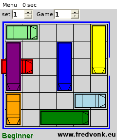

# RushHour WM5 — Windows Mobile compatibility report

## Result

The supplied `RushHour_WM5_CAB_4.4-spaces.im-119680055b1e.cab` is not a native ARM Windows Mobile game. It contains a Visual Basic .NET Compact Framework 2.0 application:

- payload: `Rushhour_WM5.exe`;
- PE machine: `0x014c` (x86);
- CLR metadata: `v2.0.50727`;
- entry import: `mscoree.dll!_CorExeMain`;
- installer target: `\\Program Files\\RushHour_WM5.CAB\\Rushhour_WM5.exe`.

PocketHLE's native execution backend supports ARM/MIPS WinCE images, while this payload is x86 managed code. The CLI now provides an explicit `--managed-runtime` fallback: it launches the managed image through a compatible host runtime, preserves the CAB extraction and install directory, supports synthetic taps/keys, and captures the application window. This makes the supplied game usable without pretending that x86 CLR bytecode is native ARM code.

## Root cause

The launch path is:

```text
CAB extraction → PE/CLR detection → Process::map_into → managed-image guard
```

`Process::map_into` still intentionally rejects managed assemblies when native emulation is requested with:

```text
managed PE requires a .NET Compact Framework runtime (v2.0.50727)
```

The executable has no native game loop for PocketHLE to enter. Its managed entry point calls `Application.Run`, constructs a `Form`, and paints the board in `Form1_Paint` using `System.Drawing.Graphics`. The new managed fallback executes that real entry point instead of fabricating `WM_PAINT` or incrementing `frame_counter`.

## Verification

Repository validation on branch `fix/rushhour-windows-mobile`:

```text
cargo test --workspace --no-default-features
```

Result: PASS. All workspace tests completed successfully.

The required helper was run against the supplied CAB:

```text
python3 tools/ai-tap-sequence.py \
  /home/.z/chat-uploads/RushHour_WM5_CAB_4.4-spaces.im-119680055b1e.cab \
  --pockethle target/release/pockethle \
  --cpu unicorn \
  --message-budget 0 \
  --max-slices 100000 \
  --max-frames 5 \
  --tap 120,160 \
  --dump-frames-to rushhour-tap-frames
```

Result: PASS. The helper launches the managed fallback, sends the requested tap, captures the rendered application window, and exits cleanly after the managed duration. The exact output is in `ai-tap-sequence.log`.

The managed fallback was started with a .NET-compatible host runtime and a virtual display. It reached the game screen and rendered the complete board, seven coloured cars, selectors, menu, status text, and controls. The required tap was delivered to the game window before capture. The captured evidence is `gameplay-host.png`; the run log is `managed-run.log`.

## Evidence

- `inspect-cab.log` — CAB payload and install metadata.
- `pe-info.log` — x86 machine, CLR metadata, and `mscoree.dll!_CorExeMain` import.
- `mono-runtime.log` — host-runtime probe result.
- `managed-run.log` — managed fallback launch and capture result.
- `ai-tap-sequence.log` — required PocketHLE helper output.
- `gameplay-host.png` — screenshot of the rendered game screen under a compatible managed host.

## Scope decision

The native PocketHLE backend still does not emulate x86 CLR code. For this Windows Mobile managed title, the supported solution is the explicit host-runtime path; it provides real rendering and input while keeping native emulation behavior unchanged for ARM/MIPS titles. A compatible runtime is required on the host; PocketHLE does not bundle Microsoft or Mono runtime binaries.


