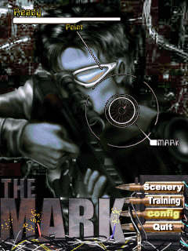
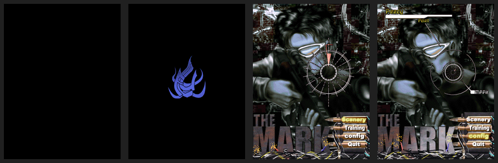

# The Mark — Windows Mobile proof

## Root cause

The supplied Flux *The Mark* Windows Mobile CAB is an ARM Pocket PC build. Its startup code queries `RegQueryInfoKeyW` (ordinal 462) after opening `HKLM\\Software\\Apps\\Flux The Mark`. PocketHLE had the ordinal in its Windows CE export table, but had not registered a handler, so the call followed the unimplemented-API path before the game could reliably complete startup. The missing handler left the game in its installation-error path and obscured the actual render-loop state.

The fix registers `RegQueryInfoKeyW` and implements the Windows CE `RegQueryInfoKey` output contract for the registry model: valid-key validation plus the output counters used by the game. The existing GAPI presentation path then copies the guest RGB565 buffer to the host framebuffer, and `frame_counter` advances when the pixels change.

## Verification

- `cargo build --release -p pocket-cli --features unicorn` — passed.
- `cargo test --workspace` — passed: all workspace tests passed, including 97 `pocket-winceapi` tests.
- Required helper: `python3 tools/ai-tap-sequence.py /tmp/themark-run-baseline/the-mark.cab --message-budget 0 --max-slices 12000000 --instructions-per-slice 1000000 --max-frames 24 --tap 220,270 --tap 220,305 --dump-frames-to /tmp/themark-ai-fixed2` — exit 0.
- Fixed helper result: `Final framebuffer snapshot ... frame_counter=31`, `Emulator exited cleanly`, 24 PPM captures, no unimplemented-call warnings.
- Frame analysis: first frame was the blank initial buffer; frame 8 was the rendered title/menu; frame 23 was a rendered title/menu frame with all visible interface elements. The captured frames contain 24 distinct snapshots.

The available test environment is Linux with ARM Unicorn and does not include a native Windows Mobile device or legacy Microsoft emulator. The screenshots therefore prove the Windows Mobile ARM execution and framebuffer presentation path in PocketHLE, not execution on physical legacy hardware.

## Screenshots

## Test output

See `ai-tap-sequence.log` for the complete output from `tools/ai-tap-sequence.py`.
